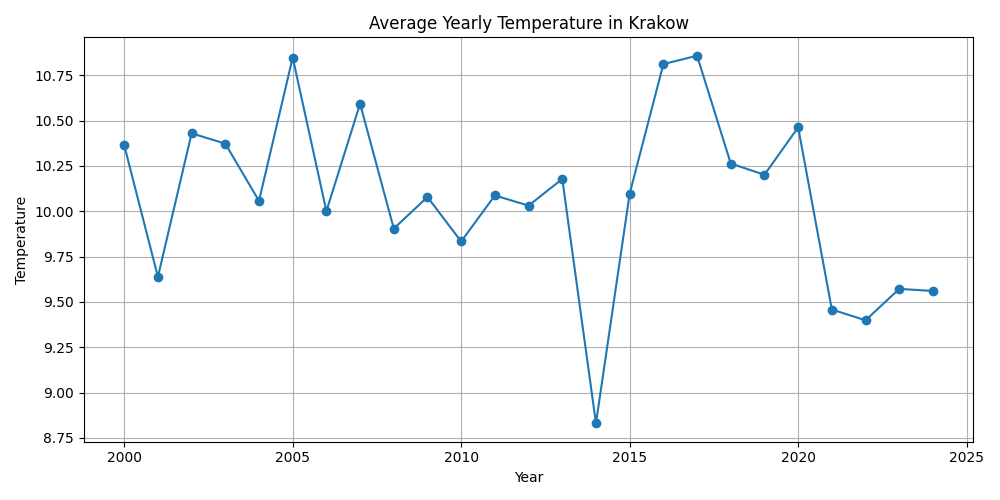
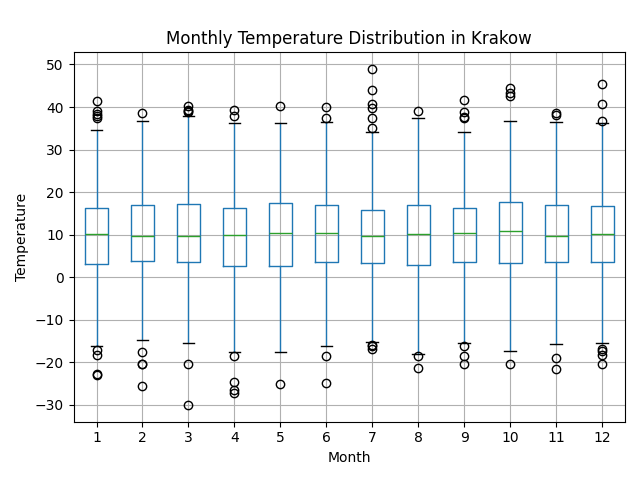

# 🌦️ Weather Analysis

Weather data analysis for **Krakow** and **Lviv** **2000-2024** using Python.

---
## 📌 Description

This project processes weather data from CSV files, cleans it, and performs statistical and visual analysis.  
Main features:

- 📊 Yearly average temperature for Krakow and Lviv  
- 📈 Rolling average temperature visualization  
- 🗓️ Monthly temperature distribution (boxplots)  
- 🌍 Comparison between Krakow and Lviv  
- ⚠️ Detection of temperature anomalies  
- 📌 Minimum and maximum temperature across **2000–2024** (for both cities)  
- 📌 Average yearly temperatures from **2000–2024** (for both cities)  

All generated plots are stored in the `plots/` folder and in your terminal.
--- 
## 🖼️ Example Plots

| Yearly Temperature | Monthly Boxplot |
|--------------------|-----------------|
|  |  |


---
## Installation

1. Create virtual environment:
   ```bash
   python -m venv venv
   ```
2. Activate virtual environment on Linux/macOS:
   ```bash
   source venv/bin/activate
   ```
   Activate virtual environment on Windows:
   ```bash
   venv\Scripts\activate.bat
   ```

2. Install dependencies:
   ```bash
   pip install -r requirements.txt
   ```

## Usage

```bash
python src/main.py
```

## Structure

- `src/` — main code (loading, processing, visualization)
- `data/krakow_weather.csv` — input data
- `plots/` — visualization results

## Dependencies

All dependencies are listed in `requirements.txt`.

## Code formatting

Format code with [Black](https://black.readthedocs.io/en/stable/) and [isort](https://pycqa.github.io/isort/):

```bash
black src/
isort src/
```

---
## 👤 Author
Created by Vladyslav Vynnytskyi ✨
